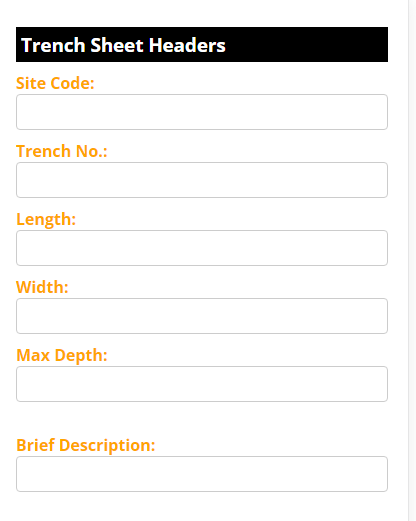
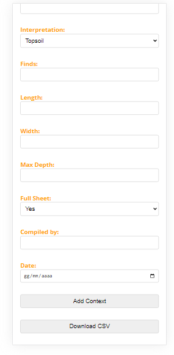
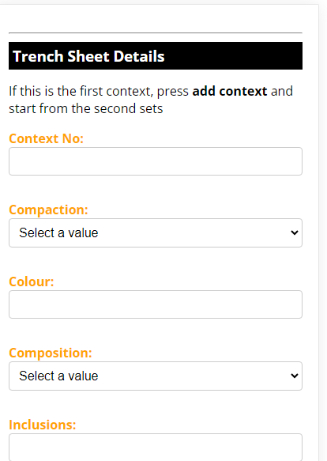

<h1> Trench Data Input</h1>

Table of Content

- [Features](#features)
- [Usage](#usage)
- [Instructions](#instructions)
- [Important Notes](#important-notes)
- [Contributing](#contributing)
- [License](#license)

This script is designed to facilitate the collection and organization of trench sheet data for archaeological purposes. It provides a user interface for inputting trench details and generating a CSV file based on the entered information.

## Features

- **Trench Sheet Headers:** Enter basic trench information such as site code, trench number, dimensions, description, and more.
- **Trench Sheet Details:** Add multiple sets of detailed information including context number, compaction, color, composition, inclusions, interpretation, finds, dimensions, and sheet completeness.
- **CSV Generation:** Generate a CSV file containing all entered data for convenient storage and analysis.

## Usage

1. Open the HTML file in a compatible browser or copy the <strong>index.html</strong> on your smartphone.
2. Fill in the required fields under "Trench Sheet Headers"

3. Press the <strong>"Add Context"</strong> button at the bottom.

4. Add the "Trench Sheet Details."

 
 
3. Click "Add Context" to add additional sets of detailed information if needed.
4. Once all data is entered, click "Download CSV" to generate and download the CSV file.

## Instructions

- **Trench Sheet Headers:** Input basic information related to the trench being documented.
- **Trench Sheet Details:** Add specific details about each context within the trench, specifying attributes such as compaction, color, composition, finds, and more.
- **Add Context:** Use this button to add multiple sets of trench details.
- **Download CSV:** Generate a CSV file containing all entered data for record-keeping or further analysis.

## Important Notes

- Ensure all mandatory fields are filled out accurately to generate a complete CSV file.
- For the first context, first press the "Add Context" button and then begin by entering data directly under "Trench Sheet Details." Use the "Add Context" button for subsequent context details.
- The 'index.html' file consolidates all necessary HTML, CSS, and JavaScript code, streamlining the app's functionality on smartphones. This single file download ensures a seamless user experience, minimizing potential setup complications.

## Contributing

Feel free to contribute to this project by suggesting improvements or reporting issues. Create a pull request or raise an issue to engage with the community and enhance this data collection script.

## License

This script is licensed under the [MIT License](LICENSE.md).
